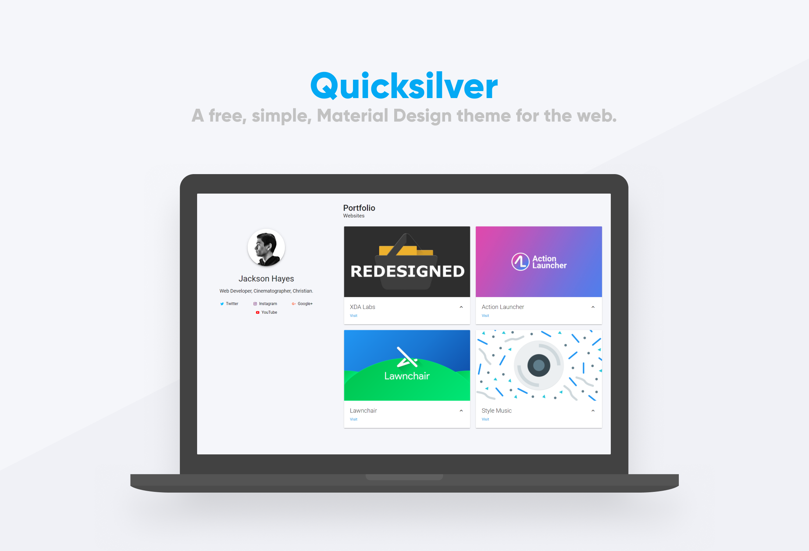

# Quicksilver
A free, simple, (mostly) material-design template for the web.

[See demo](https://jacksonhvisuals.github.io)

## Supported Browsers:
All?

## Quickstart:
- Uh... read "Getting Started"

## Getting Started:
- First, [Download the latest release](https://github.com/jacksonhvisuals/quicksilver/releases/latest) directly from GitHub. 

- You'll be presented with a number of files. The stuff you want to concern yourself with are index.html, and two folders: /json, and /images. 

- Throw a SQUARE image of yourself, your logo, whatever, inside /images. In index.html, edit the src value for profileImage to point to that profile image. 

- Replace "Your name" with... your name. 
- Replace the little description under that with some description about yourself. 
- Then a little lower, feel free to change the firstCategoryText with whatever type of work you specialize in. Or you can leave it as it is. Doesn't make a difference to me. 

- Also very important in index.html is going to be the METADATA. Up inside the head tag, edit the dummy content in the meta tags with real data. 

- Add a favicon from realfavicongenerator.net. 

- After that, open up the /json folder and take a look at links.json. Should be fairly straightforward, but here's a little explanation: 'name' is the actual TEXT that will show up for that specific link. 'color' is the color of the icon that will be next to your TEXT. 'icon' is the name of the icon from materialdesignicons.com. Make sure you get the correct spelling for the icon (you don't need the 'mdi-' part, the script automatically adds that). url is... the URL. 

- After you've edited the links.json file, you're ready to move on to items.json. This is pretty similar to the links.json file. A couple things to note, however. First, you'll need to supply an image for each item. Second, you HAVE to have all of said images match in EXACT dimensions. I suggest 1920x1080. If it's 1920x1081, things break. It's just a constraint of the MaterializeCSS framework that we're using.

- If you need to delete or add a link or work-item to your new Quicksilver website, it's super easy, thanks to the JSON implementation.

- After you feel like your website is ready to hit production, HIT THAT (figurative) UPLOAD BUTTON!

## Changelog
For changelogs, check out [the Releases section of Quicksilver](https://github.com/jacksonhvisuals/quicksilver/releases)

## Contributing
Simply fork, make your changes/contributions, and create a pull request!